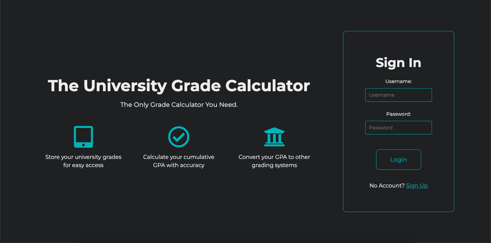
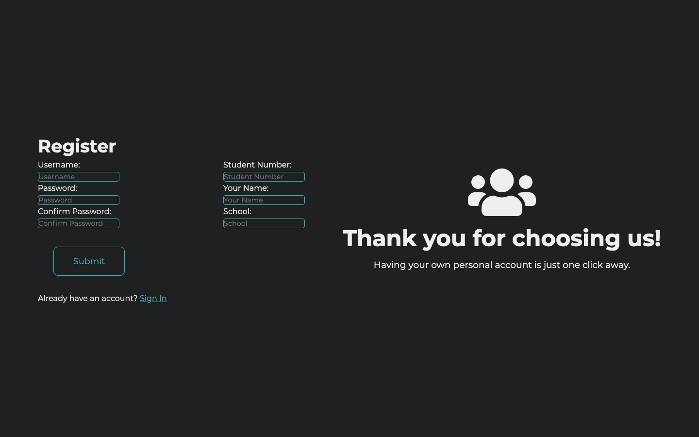
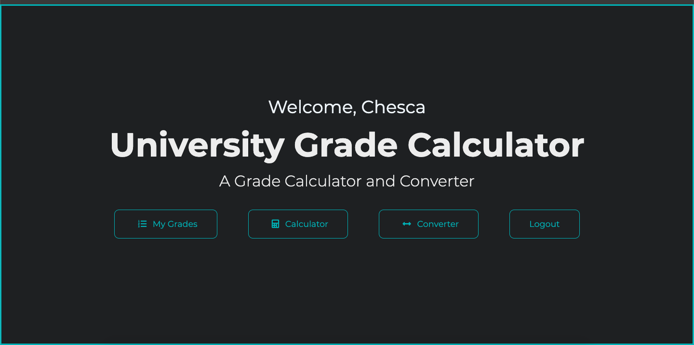
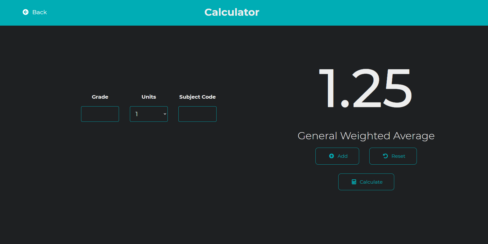
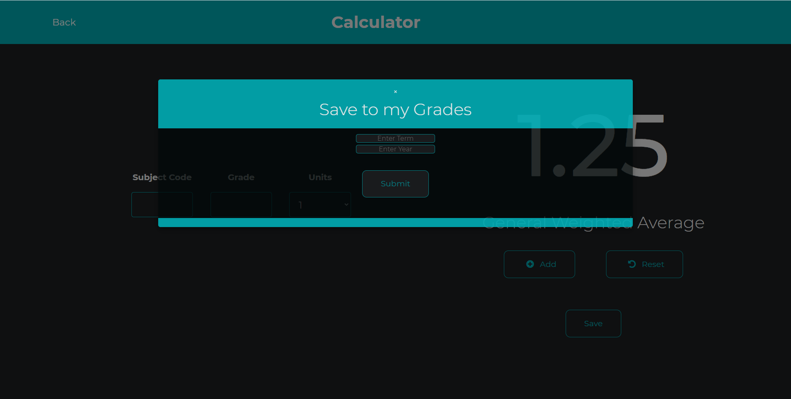

# RTDS-The University Grade Calculator

The University Grade Calculator is a webapp that can be used to calculate the General Weighted Average(GWA) of students and can be converted into Grade Point Average (GPA)

# Project Status
The project is currently in development. 

If you would like to download this webapp for testing on their own device, these are
the following steps:

# Pre-requisites
* any web server solution stack (i.e. XAMPP, MAMP, WAMP)
* any code/text editor (VS Code is recommended)
* any web browser (Chrome is recommended)

# Installation
1. Download compressed zip file of the project
2. Place compressed file on folder of web server solution stack (ie. htdocs in XAMPP)
3. Uncompress file and place files in the folder
4. Start Apache and MySql
5. Type Localhost and your port number 

# Contributing
Any contributions you make are greatly appreciated.

1.Fork the Project
2.Create your Feature Branch (git checkout -b feature/AmazingFeature)
3.Commit your Changes (git commit -m 'Add some AmazingFeature')
4.Push to the Branch (git push origin feature/AmazingFeature)
5.Open a Pull Request

## Getting Started
Sign-in Page

Sign-Up Page

Menu

My Grades Page

Calculator Page

## Authors
Gelo Ramos - @geloram  
Charles Julian - @CFrancisJ 
Renzo Tan - @renzotimtan 
VR King - @vrking39 
Chesca Faustino - @chescafaustino

### Built with
* [css](https://www.w3schools.com/Css/)
* [html](https://www.w3schools.com/html/)
* [js](https://www.javascript.com/)
* [php](https://www.php.net/)
* [SQL](https://www.mysql.com/)
